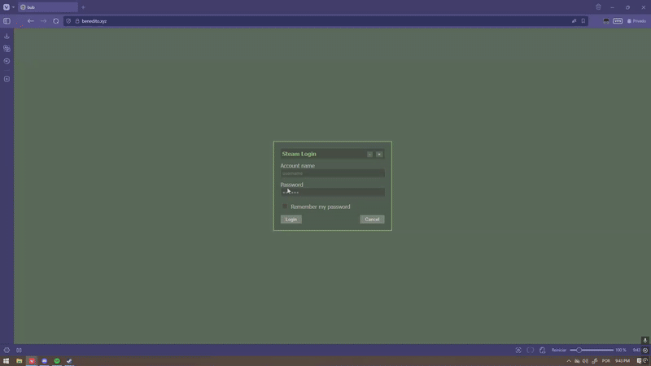

# Steam-like UI Personal Page



## Sobre o Projeto

Este é um projeto pessoal, uma releitura de uma UI inspirada no cliente do Steam dos anos 2000 e a atual, mas com um toque de "MySpace" dos velhos tempos!

A ideia principal é criar uma página pessoal interativa, um cantinho virtual onde eu possa compartilhar um pouco sobre mim, minhas redes sociais e meus gostos, tudo isso dentro de um design que remete à nostalgia dos jogos e plataformas sociais do início dos anos 2000. Não é um portfólio sério no sentido tradicional, mas sim um playground para experimentação com HTML, CSS e JavaScript.

## Funcionalidades

-   **Tela de Login Interativa:** Uma tela de login animada com som de inicialização e fade-out ao entrar! (Você não precisa de fato utilizar um login/senha, apenas clique em login!).
-   **Interface Principal Steam-like:** Navegação superior e lateral, replicando a estética do cliente Steam.
-   **Janelas Arrastáveis & Redimensionáveis:** Interaja com janelas de Perfil, Console, Music Player, Lista de Amigos e Chat, que podem ser movidas e redimensionadas dentro da área principal da tela.
-   **Delimitação de Janelas:** As janelas são "travadas" dentro dos limites visíveis da interface principal, não permitindo que escapem da tela.
-   **Console Interativo:** Digite comandos estilo Counter-Strike/Half-Life (ex: `noclip`, `god`, `clear`, `help`) com sugestões de comandos em tempo real.
-   **Music Player Integrado:** Um player funcional com playlist, controles de reprodução e volume.
-   **Lista de Amigos Dinâmica:** Veja amigos online, em jogo e offline, com contagem atualizada e barra de busca.
-   **Chat Simples:** Abra chats individuais com amigos (incluindo mensagens automáticas e links clicáveis).
-   **Mensagens de Feedback:** Notificações visuais para ações (ex: "Copied!", "Access Denied").
-   **Modo Tela Cheia:** Um botão dedicado para alternar o modo de tela cheia do navegador.
-   **Easter Eggs Escondidos:** Fique de olho em aparições inesperadas! (Dica: tente clicar nos botões principais e no console).


## Como Rodar 

1.  **Clone o repositório:**
    ```bash
    git clone [https://github.com/ravivver/site.git](https://github.com/ravivver/site.git)
    ```
2.  **Navegue até a pasta do projeto:**
    ```bash
    cd site
    ```
3.  **Abra o arquivo `index.html` no seu navegador:**
    Você pode simplesmente dar um duplo clique no arquivo `index.html` ou usar a extensão "Live Server" se estiver usando VS Code para um ambiente de desenvolvimento mais fácil.
